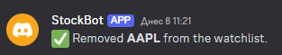

# StockBot
A Discord bot for stock market tracking and trading insights.

## Commands

### `!lookup`
🔍 **Search for stock symbols**  
Find the best-matching stock symbols based on your query. You can input anything from a stock symbol, security name, ISIN, or CUSIP.  

**Example usage:**  
```plaintext
!lookup aapl
```


---

### `!market-status`
📊 **Check global market status**  
Get the current market status for global exchanges, indicating whether they are open or closed.  

**Example usage:**  
```plaintext
!market-status US
```


---

### `!quote`
💰 **Get current stock price**  
Displays the latest stock price for a given symbol. Use `!quote <stock symbol>`.  

**Example usage:**  
```plaintext
!quote NVDA
```


---

### `!ping`
📡 **Test bot connection**  
A simple command to check if the bot is online. It should respond with "Pong!".  

**Example usage:**  
```plaintext
!ping
```


---

### `!company`
🏢 **Get company information**  
Fetch general information about a company using a ticker symbol, ISIN, or CUSIP.  

**Example usage:**  
```plaintext
!company IBM
```


---

### `!watchlist-add`
📌 **Add stock to watchlist**  
Adds a stock to the server's watchlist. The bot will notify you about its price every hour.  

**Example usage:**  
```plaintext
!watchlist-add AAPL
```


---

### `!watchlist-remove`
❌ **Remove stock from watchlist**  
Removes a stock from the server's watchlist.  

**Example usage:**  
```plaintext
!watchlist-remove AAPL
```

